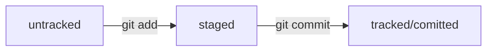

# Шпаргалка по GIT

## Создание README, markdown

```kotlin
/*пример кода котлин*/
fun main() {
    println("Hello, world!!!")
}
```


```java
/*пример кода java*/
public class Test {
   public static void main(String[] args) {                          
      System.out.println("Hello world");   
   }
}
}
```
## Команды bash

### Навигация

```pwd``` (от англ. print working directory, «показать рабочую папку») — покажи, в какой я папке;

```ls``` (от англ. list directory contents, «отобразить содержимое директории») — покажи файлы и папки в текущей папке;

```ls -a``` — покажи также скрытые файлы и папки, названия которых начинаются с символа .;

```cd first-project``` (от англ. change directory, «сменить директорию») — перейди в папку first-project;

```cd first-project/html``` — перейди в папку html, которая находится в папке first-project;

```cd ..``` — перейди на уровень выше, в родительскую папку;

```cd ~``` — перейди в домашнюю директорию (/Users/Username);

```cd /``` — перейди в корневую директорию;

```echo "текст"``` — вывести текст;

```>>``` — перенаправиь вывод команды в файл (дописать файл);

```>``` — перенаправить (перезаписать файл).

### Работа с файлами и папками

**Создание**

```touch index.html``` (англ. touch, «коснуться») — создай файл index.html в текущей папке;

```touch index.html style.css script.js``` — если нужно создать сразу несколько файлов, можно напечатать их имена в одну строку через пробел;

```mkdir second-project``` (от англ. make directory, «создать директорию») — создай папку с именем second-project в текущей папке.

**Копирование и перемещение**

```cp file.txt ~/my-dir``` (от англ. copy, «копировать») — скопируй файл в другое место;

```mv file.txt ~/my-dir``` (от англ. move, «переместить») — перемести файл или папку в другое место.

**Чтение**

```cat file.txt``` (от англ. concatenate and print, «объединить и распечатать») — распечатай содержимое текстового файла file.txt.

**Удаление**

```rm about.html``` (от англ. remove, «удалить») — удали файл about.html;

```rmdir images``` (от англ. remove directory, «удалить директорию») — удали папку images;

```rm -r second-project``` (от англ. remove, «удалить» + recursive, «рекурсивный») — удали папку second-project и всё, что она содержит.

### Полезные возможности

- Команды необязательно печатать и выполнять по очереди. Можно указать их списком — разделить двумя амперсандами (&&).
- У консоли есть собственная память — буфер с несколькими последними командами. По ним можно перемещаться с помощью клавиш со стрелками вверх (↑) и вниз (↓).
- Чтобы не вводить название файла или папки полностью, можно набрать первые символы имени и дважды нажать Tab. Если файл или папка есть в текущей директории, командная строка допишет путь сама.
- Например, вы находитесь в папке dev. Начните вводить cd first и дважды нажмите Tab. Если папка first-project есть внутри dev, командная строка автоматически подставит её имя. Останется только нажать Enter.

## Настройка git

```git config --global user.name "User name"  — задать имя от которого будут коммиты

```git config --global user.email email.ru  — задать эл.почту пользователя

```git config --list```  — посмотреть данные конфига

## Команды git

```git init``` — создать репозиторий в текущей папке;

```rm -rf .git``` — если вы случайно сделали Git-репозиторием не ту папку, её можно «разгитить». Для этого нужно удалить скрытую подпапку .git;

```git status``` — проверить состояние репозитория;

```git add``` — подготовить файлы к сохранению;

```git add --all``` — добавить все файлы в папке;

```git commit -m "Сообщение"``` — выполнить коммит с сообщением;

```git commit --amend --no-edit``` — дополнить самый последний коммит новыми файлами (они доллжны быть добавлены), сообщение не менять;

```git commit --amend --m "Обновленное сообщение"``` — дополнить самый последний коммит, исменить сообщение;

```git log``` — просмотреть историю коммитов;

```git log --oneline``` — сокращенная история коммитов;

```git restore --staged <file>``` — убрать добавленный файл;

```git restore --staged``` — убрать все stagged файлы в текущей папке;

```git restore <file>``` — откатить изменения в файле к последней закоммиченной версии;

```git reset --hard <commit hash>``` — откатить к указанному коммиту (все следующие коммиты удаляются, состояние файлов возарвщается к тому, которое было в том коммите);

```git diff``` — вывести разницу в файлах по сравнению с закоммиченной версией. Не показывает разницу в staged файлах, только в modified. Если вначале поставить более поздний хэш чем второй, будет выведена разница "наоборот";

```git diff --staged``` — покажет разницу в staged файлах;

```git diff "Начальный хэш" "Конечный хэш"``` — вывести разницу в файлах между указанными коммитами (указываются хеш-номера коммитов);

```git diff "Начальный хэш" HEAD``` — вывести разницу в файлах с начального указанного коммита до последней закоммиченной версии;


## История коммитов

### Хэш
У каждого коммита есть хэш-номер, который является уникальным идентификатором коммита. Таблица соответствия хэша и коммитов хранится в папке ```.git```. Также в ней хранится вся служебная информация гита.

## HEAD
HEAD выводится после хеша коммита, это указатель на последний коммит. В папке .git есть служебный файл HEAD, который содержит ссылку на этот коммит. HEAD — это синоним хеша последнего коммита. 

### Автор и дата
В гит лог также выводится автор и дата коммита, и его сообщение.

### Сокращенная история
Если вывести сокр историю (```git log --oneline```), то каждый коммит будет отображатся одной строкой, будет сокращенный хэш (количество выводимых символов хеша подбирается гитом) и сообщение из 72 знаков.

### Стили написания сообщений

- Корпоративный: используется код задачи из Jira, а после текст сообщения

```bash
git commit -m "LGS-239: Дополнить список пасхалок новыми числами" 
```

- Conventional Commits: тип (feat,fix,...), затем сообщение

```bash 
git commit -m "feat: добавить подсчёт суммы заказов за неделю" 
```

- GitHub-стиль: с использованием номера задачи

```bash 
git commit -m "Исправить #334, добавить график температуры"
```

## Статусы файлов

- ```untracked``` - файл есть, но гит его не видит (файл до ```git add```)
- ```staged``` - файл после ```git add```
- ```tracked``` - отслеживаемый файл (после ```git add``` и ```git commit```)
- ```modified``` - отслеживаемый файл был изменен 


## Жизненный цикл файла в git


